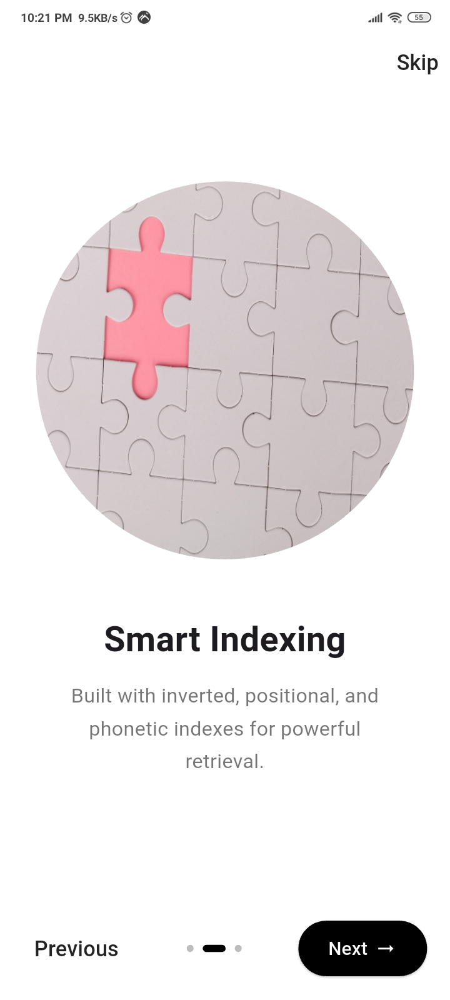
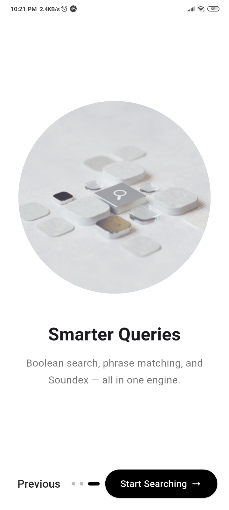
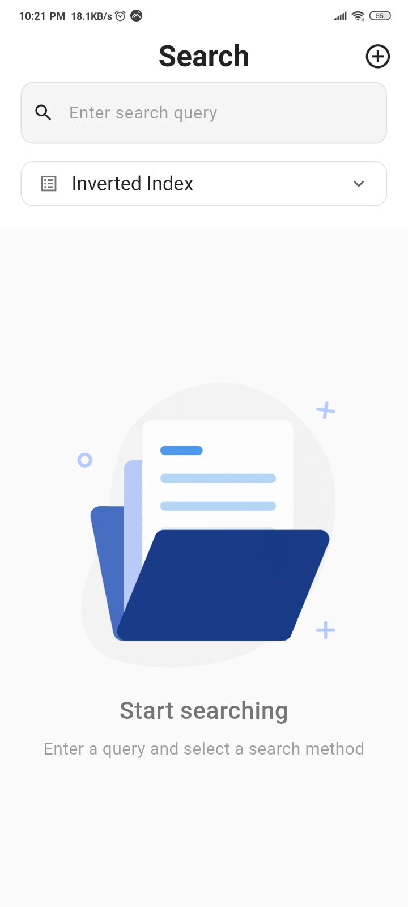
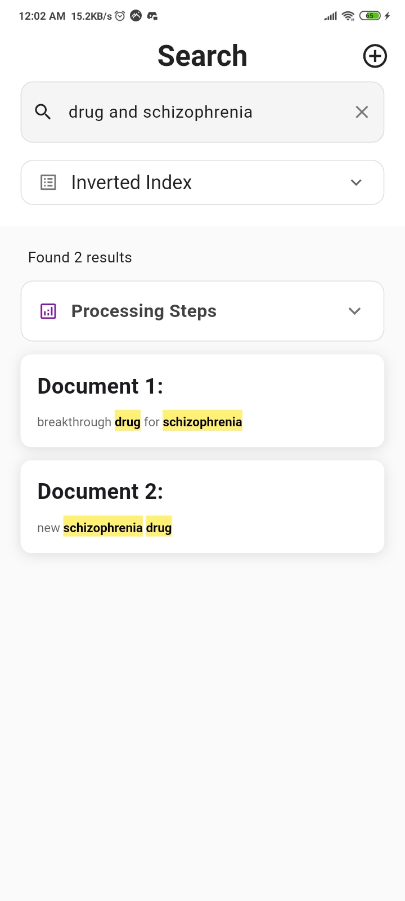
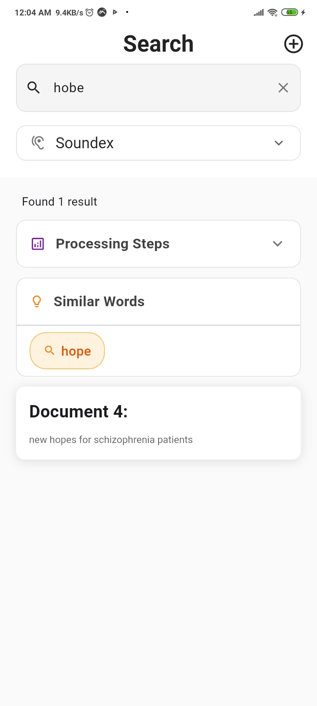

# XRetrieval – Information Retrieval Search Engine

<p align="center">
  
</p>

**XRetrieval** is a Flutter-based Information Retrieval (IR) application designed to demonstrate core search engine concepts such as indexing, query processing, and retrieval models through a clean and interactive user interface.

The app allows users to search documents using **Boolean Retrieval**, **Phrase Queries**, and **Phonetic (Soundex) Search**, applying real IR techniques behind the scenes.

---

## Table of Contents

* [Key Features](#key-features)
* [Technical Implementation](#technical-implementation)
* [Search Models](#search-models)
* [App Preview](#app-preview)
* [Project Structure](#project-structure)
* [Dependencies](#dependencies)
* [Setup Guide](#setup-guide)
* [App Link](#app-link)
* [Academic Context](#academic-context)

---

## Key Features

✅ **Index-Based Search**

* Inverted Index for fast term lookup
* Positional Index for phrase queries
* Soundex-based phonetic search

✅ **Query Processing**

* Tokenization
* Stop-word removal
* Stemming
* Query normalization

✅ **Search Models**

* Boolean Retrieval (AND, OR, NOT)
* Phrase Queries
* Phonetic Search (Soundex)

✅ **User Experience**

* Clean and responsive Flutter UI
* Onboarding flow with saved state
* Highlighted search terms in results
* Toast messages for feedback

---

## Technical Implementation

**Frontend (Mobile App)**:

* Flutter
* BLoC / Cubit for state management
* Responsive UI using ScreenUtil
* Lottie animations for onboarding

**Backend**:

* RESTful API (connected via HTTP)
* Handles indexing, query processing, and retrieval logic

**Architecture**:

* Clean feature-based architecture
* Separation of concerns (core, data, features)

---

## Search Models

🔹 **Boolean Retrieval**
Supports logical operators such as AND, OR, and NOT for precise document filtering.

🔹 **Phrase Queries**
Uses positional indexing to retrieve documents where terms appear consecutively.

🔹 **Soundex (Phonetic Search)**
Matches phonetically similar terms to improve recall for misspelled or similar-sounding queries.

---


## App Preview

### Screenshots

####  Add Document
<div align="center">
   <div>
  
  </div>
</div>

####  onboarding
<div align="center">
   <div>
  
  
  
  </div>
</div>

####  Search
<div align="center">
   <div>
  
  
  
  
  </div>
</div>

---

## Project Structure

```
lib/
├── core/
│   ├── cache/              # SharedPreferences for onboarding
│   ├── config/             # API base URL
│   ├── const/              # Constants (strings, assets)
│   ├── routes/             # Navigation & routing
│   └── utils/              # Utilities (text highlighter, stop words)
│
├── data/
│   ├── models/             # Data models (SearchResult, SearchResponse)
│   └── services/           # API service layer
│
└── features/
    ├── onboarding/         # Onboarding screens
    │   ├── bloc/
    │   ├── presentation/
    │   └── widgets/
    │
    ├── search/             # Search functionality
    │   ├── cubit/
    │   ├── presentation/
    │   └── widgets/
    │
    └── add_document/       # Add document feature
        ├── cubit/
        ├── presentation/
        └── widgets/
```

---

## Dependencies

```yaml
dependencies:
  flutter:
    sdk: flutter

  # State Management
  flutter_bloc: ^8.1.3
  bloc: ^8.1.2
  equatable: ^2.0.5

  # HTTP & Networking
  http: ^1.1.0

  # UI & Animations
  flutter_screenutil: ^5.9.0
  lottie: ^3.0.0
  fluttertoast: ^8.2.4

  # Storage
  shared_preferences: ^2.2.2
```

---

## Setup Guide

1️⃣ Clone the repository

```bash
git clone https://github.com/your-username/XRetrieval.git
```

2️⃣ Navigate to the project directory

```bash
cd XRetrieval
```

3️⃣ Install dependencies

```bash
flutter pub get
```

4️⃣ Run the app

```bash
flutter run
```

---

## App Link

🔗 **.apk file / The Application:**
[https://drive.google.com/file/d/1rz4Wk7SS_vMcfX5aofv3jrQCaA6j3BeD/view?usp=sharing]

---

## Academic Context

This project was developed as part of an **Information Retrieval course**, aiming to:

* Apply IR theory in a practical system
* Understand indexing and retrieval mechanisms
* Build a complete search engine pipeline with a real UI

---

✨ **XRetrieval – Find Your X.**


